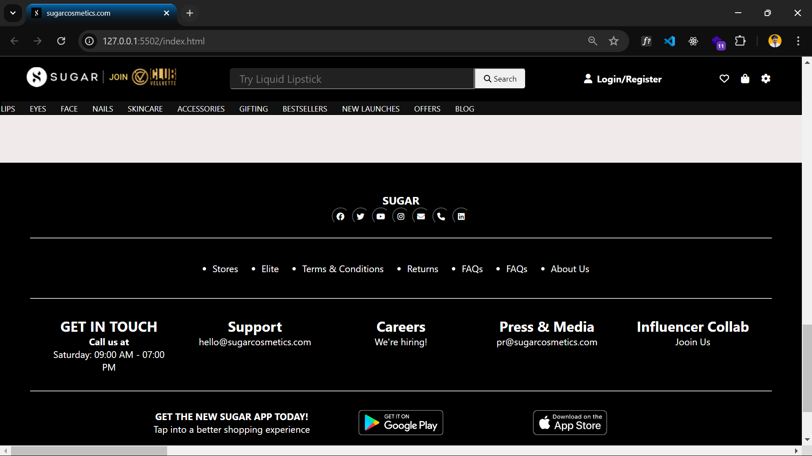

# SuggerCosmatic Website Clone

## Description
This project is a clone of the SuggerCosmatic website, created using HTML, CSS, and JavaScript. It features a responsive design and includes a JavaScript-powered slider on the main page.

## Fundamental Technologies
- **HTML**: Provides the structure of the web pages.
- **CSS**: Handles the styling and layout of the website.
- **JavaScript**: Adds interactivity, including the implementation of the slider on the main page.

## Main Page Screenshot

## Footer Section Screenshot

## Live Link
You can view the live version of the website [here](https://ephemeral-beignet-a8438d.netlify.app).

## GitHub Repository
You can find the code for this project on GitHub [here](https://github.com/susheelvishwa/sugarcosmetics_-project).

